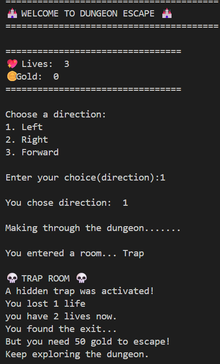
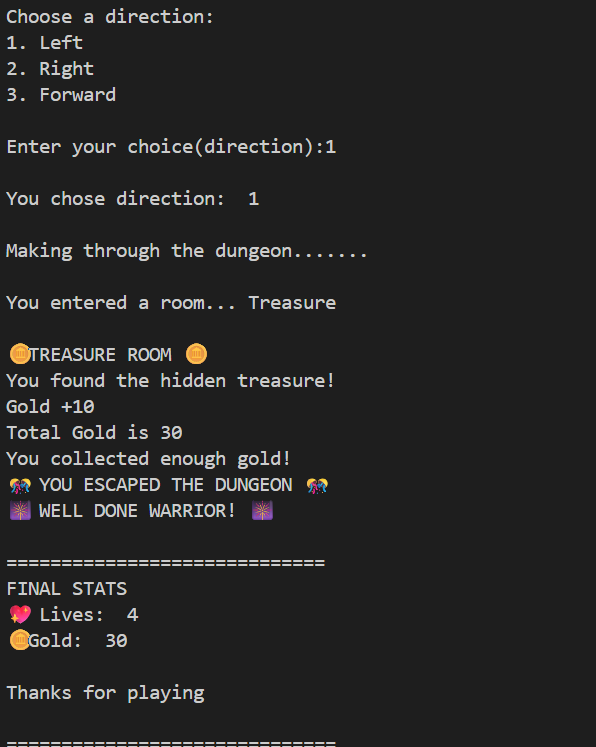

# 🏰 Dungeon Escape Game

A text-based adventure game built with Python where players explore a dangerous dungeon, collect treasure, survive monsters, and find the exit.

## 🎮 Gameplay

Navigate through the dungeon by choosing a direction each turn.

Possible encounters include:

* 💰 Treasure Rooms
* 👹 Monster Rooms
* ❤️ Healing Rooms
* ☠️ Trap Rooms
* 🚪 Exit Room

Collect enough gold, stay alive, and escape the dungeon.

## ✨ Features

* Random room generation
* Gold collection system
* Lives/health system
* Multiple room types
* Win and lose conditions
* Terminal-based gameplay

## 🛠️ Built With

* Python
* Random Module

## 📸 Screenshots

### Welcome Screen


### Gameplay



### Victory Screen



## ▶️ Running the Game

```bash
python dungeon_game.py
```

## 🚀 Future Improvements

* Inventory System
* Boss Battles
* Save/Load Progress
* Difficulty Levels
* Dungeon Map System
* GUI Version with Tkinter

